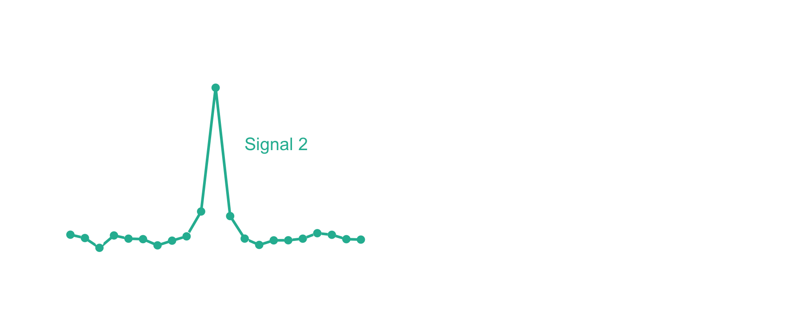
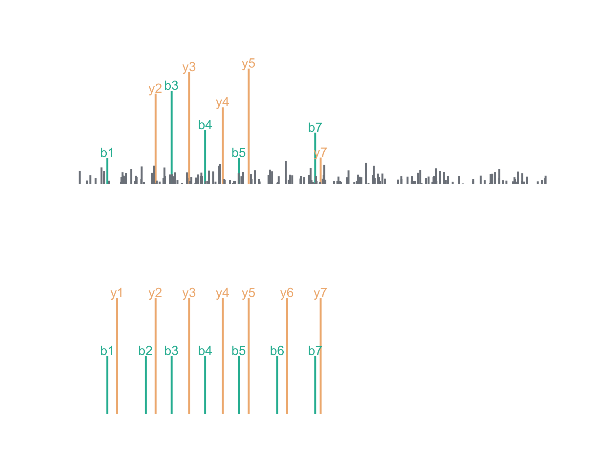
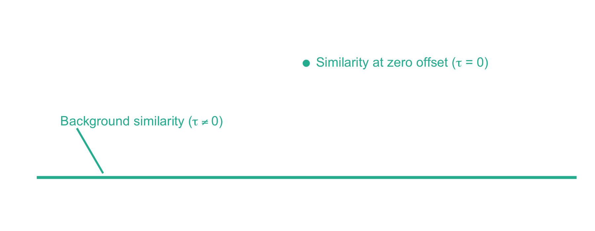
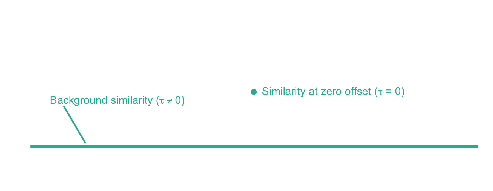
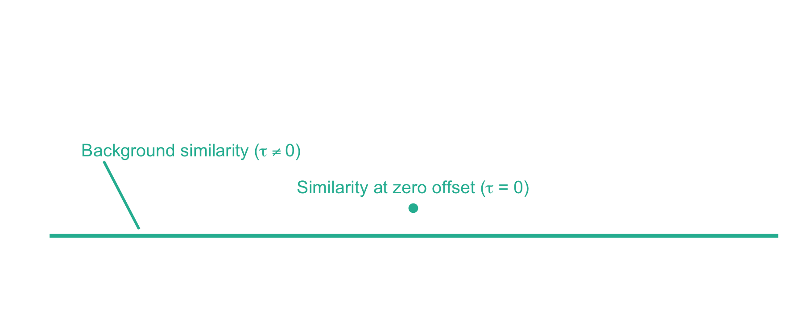
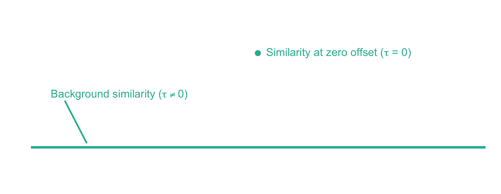

*Welcome to my first blog post! This one is intended for those who are familiar with database searches in proteomics, but want to learn more about how the search engine works.*

In proteomics, a database search is one of the most common methods to assign a peptide sequence to an observed mass spectrum. While there are numerous database search algorithms today, all rely on an underlying score function to assess the quality of a peptide-spectrum match (PSM). One such score function is xcorr, which is still a mainstay in the field despite being the score function of the first proteomics database search engine, [SEQUEST](https://link.springer.com/article/10.1016%2F1044-0305%2894%2980016-2). It underlies several modern database search engines, including [Comet](http://comet-ms.sourceforge.net/), [Crux Tide](http://crux.ms/), [ProLuCID](https://www.sciencedirect.com/science/article/pii/S1874391915300592?via%3Dihub), and current SEQUEST implementations.

In this post, I hope to provide an intuitive understanding of what xcorr means and its implications as a score function today.

## What is xcorr?

The xcorr score function gets its name from the signal processing technique known as cross-correlation. Let's imagine that you have two signals measured over time, but offset from one another, like in the left panel below. Cross-correlation provides a measure of similarity between the two signals as a function of time. When offset in time such that signals are aligned, the value will be high. In contrast, at offsets where the signals are not aligned, the value will be low. The similarity measure is equivalent to a dot product at each offset, which is why cross-correlation is sometimes referred to as a "sliding dot product."

In the case of mass spectrometry, we expect the theoretical peptide ions and the ions in an acquired mass spectrum to align on the *m/z* axis if the PSM is correct. Likewise, very few theoretical and observed ions should align if the *m/z* axis of either is offset. The xcorr score function capitalizes on this by using local *m/z* offsets as a background. Now let's take a look at the fast xcorr calculation used by Comet:[^1]

$$ xcorr = x_0 \cdot y' \quad \text{where} \quad y' = y_0 - \left(\sum_{\tau=-75, \tau \neq 0}^{\tau=+75} y_\tau \right) / 150$$

While these equations may look intimidating, fortunately their explanation is fairly straightforward. Here, $x_0$ represents the theoretical mass spectrum of a peptide from your database and $y$ represents the acquired mass spectrum at different *m/z* offsets, $\tau$. When $\tau = 0$, $y$ is just the acquired mass spectrum[^2]. The second equation, which calculates $y'$, is just the acquired mass spectrum minus the average of it shifted 75 *m/z* bins[^3] in either direction. Because the dot product is distributive, xcorr is the similarity between the theoretical and acquired mass spectra with the mean similarity from the *m/z* offsets subtracted.[^4]

## An illustrated example

Let's say we've acquired the following (*completely made up*) mass spectrum and we think it's the peptide, LESLIEK. Here, I've chosen to keep it simple with just *b* and *y* series ions. We can plot the acquired mass spectrum and the theoretical mass spectrum for LESLIEK:

Now we can plot the cross-correlation between the acquired and theoretical mass spectra to visualize the two components of the xcorr score function:

From here, xcorr is just the similarity at zero offset minus the background similarity. For the LESLIEK peptide, xcorr = 5.77 - 0.38 = 5.39. We can also do this for an incorrect peptide, such as the scrambled sequence, LISELEK. In this case we expect xcorr to be lower and fortunately, it is. I've plotted the cross-correlation results below, which show the xcorr is 3.11.

## Considerations for using xcorr

The xcorr score function has proven to be powerful in the proteomics field. Specifically, it is very good at ranking candidate peptides for a mass spectrum in question. Why is this the case? I think it's largely because the xcorr score function penalizes unmatched ions between the theoretical and acquired mass spectrum. However, there are some caveats when using xcorr:

-   The xcorr score function is *uncalibrated*. That is, a good score for one spectrum may not be a good score for another. This causes problems when trying to interpret how confident a PSM is in relation to the other PSMs you've found. Fortunately, there are a variety of methods that fix this weakness: Post-processing with tools like Percolator or PeptideProphet, the exact p-value calculation available in Crux Tide, and the E-values estimated by Comet are some examples.

<!-- -->

-   The standard xcorr score function is not well suited for open modification searches because it penalizes unmatched ions. While this feature is a strength for traditional closed searches, the xcorr score is significantly deflated when half the fragment ions fail to match due to an unaccounted modification. As an example, let's imagine instead we acquired a high quality mass spectrum for the phosphorylated peptide, LESpLIEK, and we tried matching it to the correct sequence (LESLIEK) in an open modification search. Below is what the cross-correlation would look like, yielding a poor xcorr score of 0.84. For comparison, the xcorr score when the matching against the correct phosphorylated peptide is 4.61.

That about wraps it up. I hope that this post was helpful and has provided some insight into how xcorr works. If you liked it and want to see more things like it, please let me know!

[^1]: From Eng JK, *et. al*. **(2008)** A fast SEQUEST cross correlation algorithm. J Proteome Res. [Link](https://pubs.acs.org/doi/pdf/10.1021/pr800420s).

[^2]: Plus any preprocessing that was done.

[^3]: The bin size is controlled by Comet's "fragment_bin_tol" parameter.

[^4]: It's worth noting that, although calculating the cross-correlation across all of the offsets is useful for understanding how xcorr works, the equation above describes a faster way to calculate it. A mass spectrum can be preprocessed by subtracting the mean intensities at all of the offsets. Then a single dot product between the preprocessed mass spectrum and the theoretical peptide mass spectrum yields the xcorr score, which is made possible because of the distributive property of the dot product.
