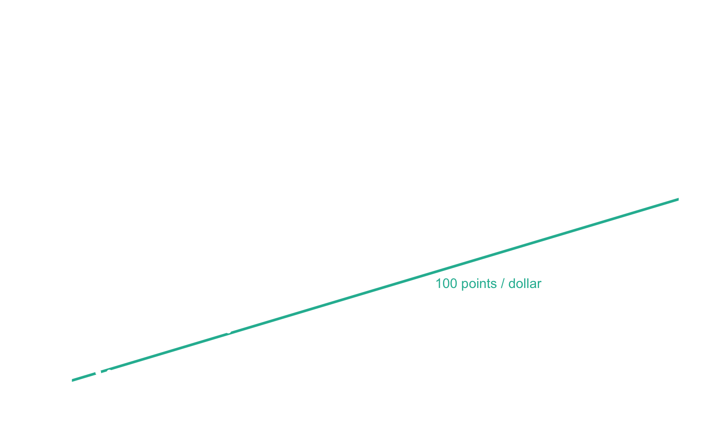
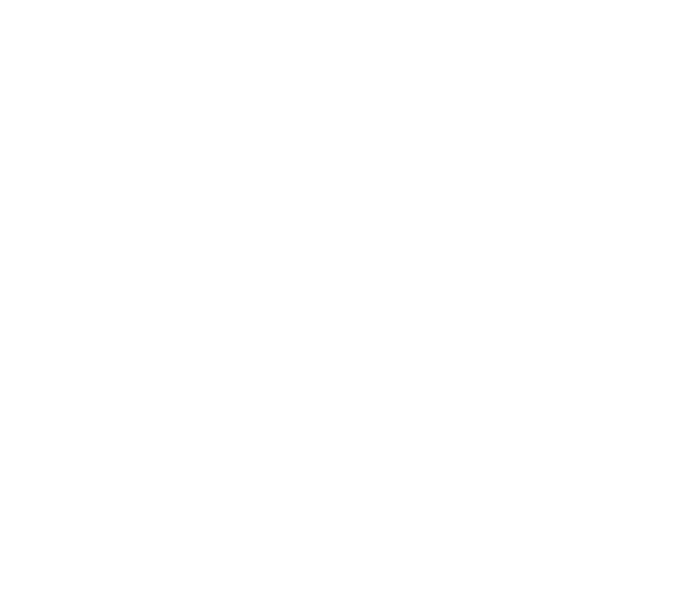

My family and I love to eat at Chick-fil-A. While we will forever miss the
Chick-fil-A Cow Calendar (which was sadly ended in 2018) we have enjoyed their
new rewards program. This short post is entirely about getting the best value
from it.

## The rewards program

The [Chick-fil-A One](https://www.chick-fil-a.com/one) rewards program is pretty
simple in how it works:
You receive points for each dollar spent at Chick-fil-A, which can then
be redeemed for a variety of menu items at a latter date. However, I noticed
that the number of points required for a few items was not proportional to
the item's menu price.

**So, what is the most efficient way to spend my points?**

Naturally, I had to know.

## Point costs are roughly proportional to dollar values

To answer this question, I manually looked up the number of points required
for each menu item and their corresponding menu price at our local Chick-fil-A.
Unsurprisingly, it seems that the point cost of an item is
largely proportional to the item's dollar value. There are some interesting
deviations from this though: The three salads require disproportionately more
points to redeem than the other items.

## Waffle fries are king

One thing we can do is look at which items give your points the most purchasing
power. In this case, the medium waffle fries are the clear winner coming in at
a value of \$0.01145 per point redeemed.

## Conclusion

Since I always get a spicy chicken sandwich and fries anyway, I'll now
redeem points for the fries instead of the sandwich. Unfortunately, your mileage
with this analysis may vary---the results may be different for other locations
and if discounts from combos were considered.

It may not seem like much, but if you're like me, this helps the postdoc dollars
go a little further.
