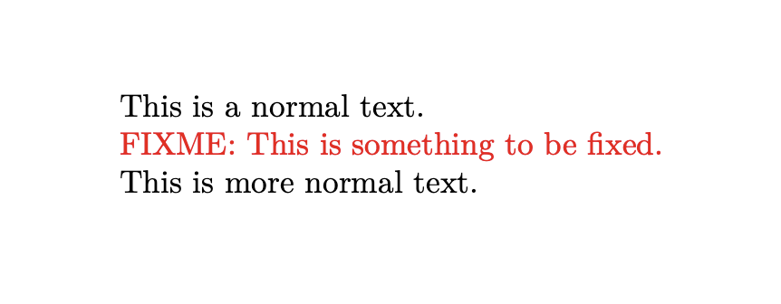

Over the years, I've written quite a few papers, grants, and other kinds of documents using LaTeX; and like most things in science, these documents were rarely written alone. 
In this post, I'm going to share some of the tips I've accumulated for writing with collaborators using your text editor of choice, git, and GitHub.[^1] 
Please note that this post assumes you're familiar with GitHub, git, and parts of the contribution workflow (pull requests, merging, etc.), and already know how to write and compile a LaTeX document.

[^1]: Most of these tips apply to other markup languages, like markdown, re-structured text, and typst. I just chose to write about LaTeX because I find it is the most popular for writing papers and it is often the most painful to collaborate with.

Why are talking about writing LaTeX?

For better or worse, LaTeX is the *de facto* language in which to write scientific papers for computational/mathematical/physics fields. 
Unsurprisingly, I find that folks who are new to LaTeX often struggle to effectively write with other authors without tools like [Overleaf](https://www.overleaf.com) to help. 
I have nothing against Overleaf---in fact, I think it is a great tool---but using it removes me from my [favorite text editor](https://github.com/doomemacs/doomemacs) and out of the Git+GitHub ecosystem that I've become accustomed to for software development.
However, Overleaf does solve critical problems for folks writing in LaTeX; it provides a mechanism to handle revisions as elegantly as with "track changes" and comments of Word-like WYSIWYG editors.
Using Overleaf also ensures that everyone can compile the document without additional thought. 

With a little planning and a few rules, I think that GitHub can actually make for a pleasant collaborative writing experience; after all, folks use it to write code collaboratively all the time! 
Here, I've tried to distill my workflow for writing LaTeX documents collaboratively with GitHub into ten tips.[^2]

[^2]: Shout out to Bill Noble, my postdoc advisor who's process inspired many of these tips!

## 1. Write a README

Just like when developing software, a README should be the first stop for folks when contributing to your document. 
The README is your opportunity to make sure everyone is on the same page with how the document is to be written.
What should you put in the README? 
At a minimum, I suggest specifying software dependencies and how to compile the grant. 
Use it as an opportunity to write about the scope of the document, provide an outline, or any other instruction about the content that you're planning.

For example, you might include something like the following to get folks started:
> ### Dependencies
> #### TeX Live
> On a Mac, it is easiest to install TeX Live with [homebrew](https://brew.sh/):
> ```
> $ brew install --cask mactex
> ```
> Or you can install it manually:
> - For MacOS specifically: https://www.tug.org/mactex/
> - For other platforms: https://www.tug.org/texlive/ 

The idea is that the README helps your collaborators get started in your document, so include whatever you think is helpful.

## 2. Provide a Makefile

There are a ton of ways to compile a LaTeX document, but many of them will end in frustration if they're not compatible with the way that you intend for the document to be compiled.
[GNU make](https://www.gnu.org/software/make/) is a tool designed to help folks reproducibly compile software, but it also helpful for compiling LaTeX documents.
A Makefile contains rules to build specific targets---in our case, this is ultimately the compiled PDF of our document---and captures the dependencies that are required to build these targets.
Including a Makefile in your repository that defines how to build your document makes it easier for everyone to compile it exactly the same way, every time a file changes.

Here is an example Makefile that I often start from:
```Makefile
.PHONY: clean all

all: my_document.pdf # The name of your .tex file.

# An implicit rule to compile the PDF using latexmk
%.pdf: %.tex refs.bib
	latexmk $*.tex -pdf -xelatex

# A simple cleaning rule to cleanup the directory.
clean:
	rm -f \
		*.bbl *.aux *.blg *.bcf *.out \
		*.run.xml *.fls *.fdb_latexmk *.xdv \
		*.lof *.lot *.log
	rm -rf auto
```

Assuming that a collaborator has all of the necessary software installed, compiling the document is as easy as typing "`make`."

## 3. Add a FIXME macro

As you write your document, you'll inevitably run into specific sections that other folks may need to complete, or that you need to revisit later.
For that, I find it useful to define a "FIXME" macro that helps me remember these instances.

Here is an tiny example document using such a macro:
```tex
\documentclass{article}
\usepackage[margin=1in]{geometry}
\usepackage{xcolor}

% The FIXME macro:
\newcommand{\fixme}[1]{\color{red} FIXME: #1 \color{black}}

\begin{document}
This is a normal text.

\fixme{This is something to be fixed.}

This is more normal text.
\end{document}
```

This tiny document results in a PDF containing the following, where our FIXME is in red:



## 4. Draft a Document Skeleton

One of the most annoying parts about writing documents collaboratively using git is merge conflicts.
While some of these are inevitable, many can be avoided by simply starting from a document skeleton; add the sections that you expect to be in the final document, even if they are merely titled with placeholder text. 

After folks have written their respective sections, recombining them should now be a breeze. 
Git will know now exactly how they should be merged instead of trying to overwrite one another's changes---at least as long as the sections remain in the same order.

## 5. One sentence per line and one line per sentence

Each sentence should be written on its own line, no matter how long the sentence is. 
Why?
When you start reviewing changes, only the sentences that were changed will appear in the git diff.
You'll also be able to move sentences and whole paragraphs around in the document with digestible git diffs to review. 

## 6. Define how references will be managed

Making sure everyone understands how references will be managed from the start helps avoid the painful process of gathering and reformatting references at the end.
I personally like to manage references using a shared [Zotero](https://www.zotero.org/) library which I set to autoupdate a `.bib` file as part of the repository. 
The primary downside of this approach is that there is currently not a good way for multiple folks to export the same library from Zotero and guarantee that the `.bib` file is updated the same way; hence, I ask folks to add their references to the Zotero library and I manage the `.bib` file.

There are other approaches though!
For example, when I was a postdoc, the Noble lab maintained a giant `.bib` file that everyone used and was responsible for adding new reference that they needed. 
While this lacks some of the niceties that reference managers like Zotero provide, it is effective and everyone can instantly add the references they need.

The important point of this tip is not how exactly the references are managed, but rather that the expectations for how they are managed are clearly communicated to everyone contributing to the document. 
This sounds like a good candidate for README content, right?

## 7. Use pull requests for revisions and reviews

GitHub already offers a powerful mechanism for proposing code changes to a repository: [Pull Requests](https://docs.github.com/en/pull-requests/collaborating-with-pull-requests/proposing-changes-to-your-work-with-pull-requests/about-pull-requests)! 
When working together on a document, folks should propose their revisions through a pull request. 
Doing so unlocks a lot of nice features---a place for the discussion of the revisions, line by line comments (you did follow #5 right?), and even emojis to help with review. 
I find this to be a powerful alternative to "track changes" and comments in Word-like editors.

You can also take this to the next level by protecting your main branch, such that all contributions---including your own---must be reviewed in a pull request before they are integrated.

## 8. Open issues for TODOs

There are many ways to organize and plan a document, but one nice thing about GitHub is the built-in issue tracker that you have access to. 
I like to open issues with assignments for sections that folks need to complete, revisions that need to happen, missing figures, or anything else that the document needs.
A nice aspect of using issues is that it allows for both conversation around the task and tracking its progress. 
You can link new pull requests to issues, closing them as they are reviewed and merged into the document.

## 9. Keep manuscript revisions in separate files

This tip is mostly specific for scientific manuscripts where the process of publishing involves submitting a manuscript to a journal or conference, then responding to reviewers and revising the document for publication. 
During this process, it is nice when you can point to the text from the manuscript that has changed during the revision from directly within your response document. 
This makes it just a little bit easier for reviewers, which is typically a good thing.
However, you absolutely do not want to deal with the onerous and error-prone task of copying edits between your manuscript and a response document.

Instead, create separate files for each block of text that is edited and use `\input{}` macros to insert them into the respective text.

For example if we create the following `edit.tex` file:

```tex
This is the new text that I want to add.
```

We can easily add it to our manuscript:
```tex
This is text in the manuscript.
\input{edit.tex}
This is more text in my manuscript.
```

and to the response document:
```tex

We thank the reviewer for their insightful comments.
In light of them, we have added the following:

\input{edit.tex}
```
It's also worth noting that you can add specific formatting to highlight these changes in a different color or indent them.

## 10. Use a `.gitignore` and add the compiled document to it

A `.gitignore` specifies what files should not versioned by git. 
If you aren't already using `.gitingore` files, I recommend generating one with [gitignore.io](https://gitignore.io).
Specifically, make sure to add the your compiled document to this file.

Why add the compiled document? 
This PDF will change every time we edit our document and the differences between the files will be unintelligible.
Instead we should just rely on our Makefile (which you created right?) to generate our PDF when we need it.

## Bonus: Use GitHub Releases for important versions

This tip is a bit over the top, but can be helpful in some cases. GitHub Releases (and vanilla git tags) allow you to highlight important versions of a document.
For example, you can create a release when a grant is submitted, then a new release after revising it when it is not discussed. 
Marking these versions with releases makes it quicker to take a time warp back to when it was written if you ever need to refer back to it.

**Bonus bonus:** You can also use CI/CD platforms like GitHub Actions to automatically compile the document and upload the compiled PDF to the release!
However, I find that this is rarely worth the trouble of setting it up.


## Wrapping up

In this post I've shared some tips about my workflow for writing LaTeX documents with others on GitHub. 
I hope that it helps you on your writing journey!
If you enjoyed this post and want me to write more like it, consider [buying me a coffee](https://www.buymeacoffee.com/wfondrie) to let me know.
<!--  LocalWords:  reproducibly
 -->
