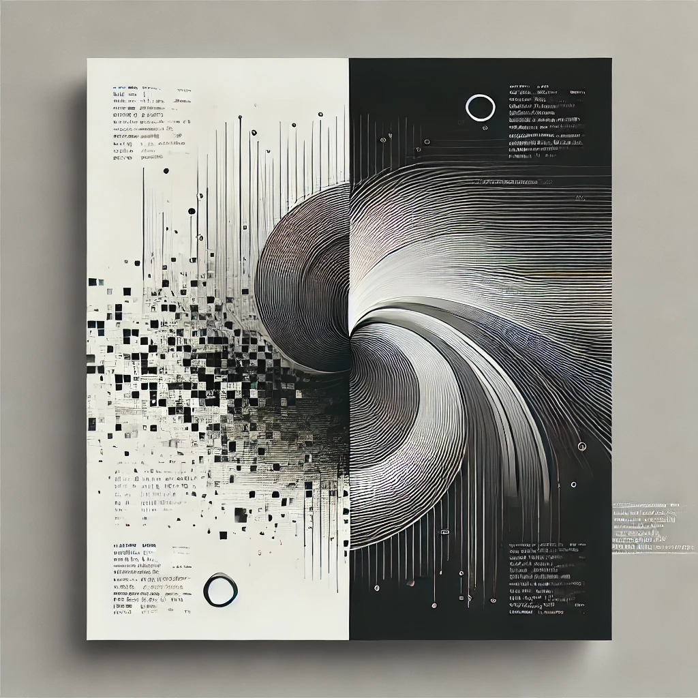
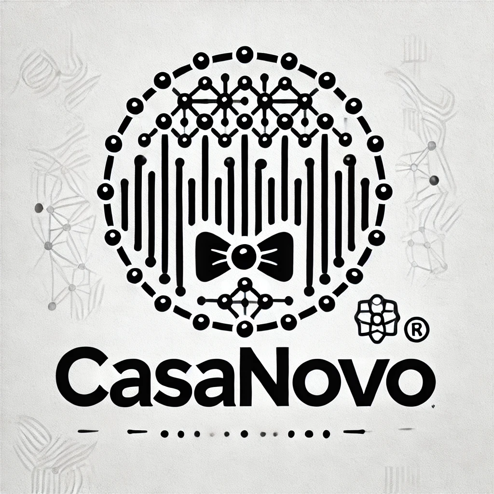

I find that generative models are fantastic for brainstorming creative ideas, such as logo designs for new software.
However, while LLMs like ChatGPT can generate stunning images, they're [notoriously bad at creating vector graphics](https://gpt-unicorn.adamkdean.co.uk/) like SVGs!
In this short post, I’ll show you how to take raster graphics—like PNG or JPEG files—and transform them into monochrome SVG vector graphics, all from the terminal.
This process is quick, flexible, and doesn’t require expensive design software.

## Prerequisites

Before we start, you’ll need two tools: [ImageMagick](https://imagemagick.org/index.php) and [Potrace](https://potrace.sourceforge.net/).

On my Mac, I install them with [Homebrew](https://brew.sh/):

```
brew install imagemagick potrace
```


And that's it!
You're ready to go.

## Step 1: Generate a Draft Logo

For this example, I used ChatGPT to brainstorm a draft logo for [Casanovo](https://casanovo.readthedocs.io/en/latest/), a project I contribute to that currently lacks a logo.
Here’s how I prompted it.

First, I gave ChatGPT context about Casanovo:
> You are a graphic designer specializing in minimalist, monochrome logos for software. Read the paper for our software, "Casanovo", noting how the functionality, design, and "Casanova" theme could be used to draw a logo: https://www.biorxiv.org/content/10.1101/2023.01.03.522621v4.full.pdf

Then, I asked for the design:
> Create a minimalist, monochrome icon for Casanovo with a white background. Keep it simple, modern, and uncluttered.

ChatGPT generated a raster graphic in WebP format as a starting point.
While it didn’t fully align with my vision, it was a decent foundation for further refinement:



## Step 2: Convert to SVG

Next, let’s transform this raster graphic (`casanovo.webp`) into an editable SVG.
This single-line command does the trick:

```
magick casanovo.webp -threshold 50% PBM:- | potrace -s - -o casanovo.svg
```

Here’s the result, rendered as an SVG:


## Step 3: Refine Your Design

With your SVG file ready, you can open it in any vector editing software[^1] for further customization.
Tweak it until the design matches your vision!

## Wrapping Up

And there you have it—a quick and effective way to convert raster graphics into SVG vector files, all from the comfort of your terminal.
ImageMagick is pretty powerful and I'll leave it to explore how might create multi-color SVGs rather than sticking with the monochrome version we created here.
Whether you’re creating logos, icons, or any other graphic, this workflow is a handy addition to your creative toolkit.

If you enjoyed this post and want more tips like it, [consider buying me a coffee](https://www.buymeacoffee.com/wfondrie) to show your support!

[^1]: I personally like [Affinity Designer](https://affinity.serif.com/en-us/designer/).
